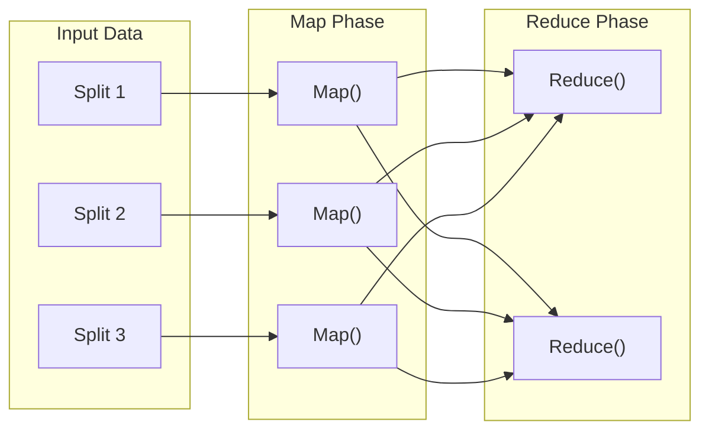
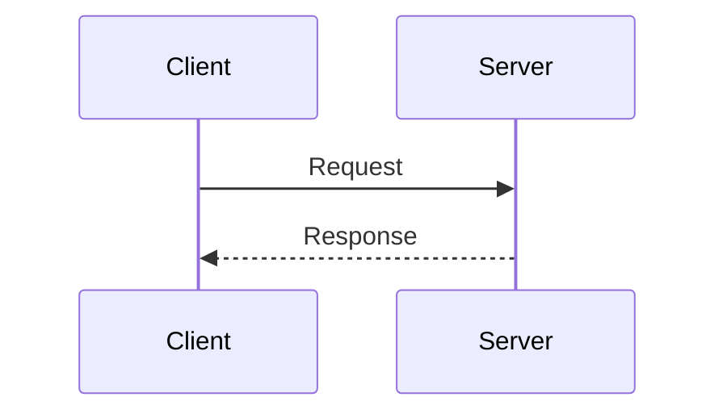
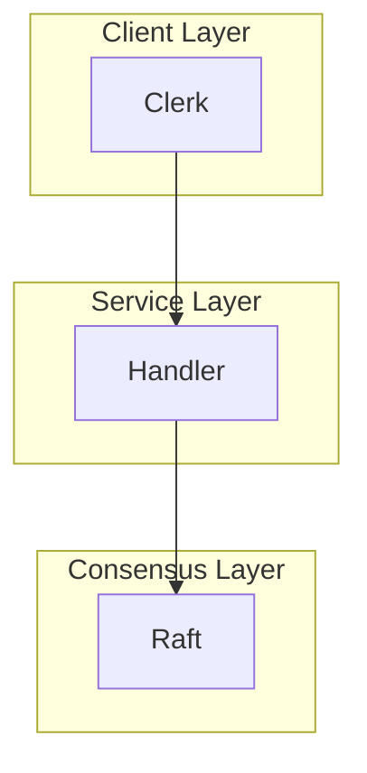
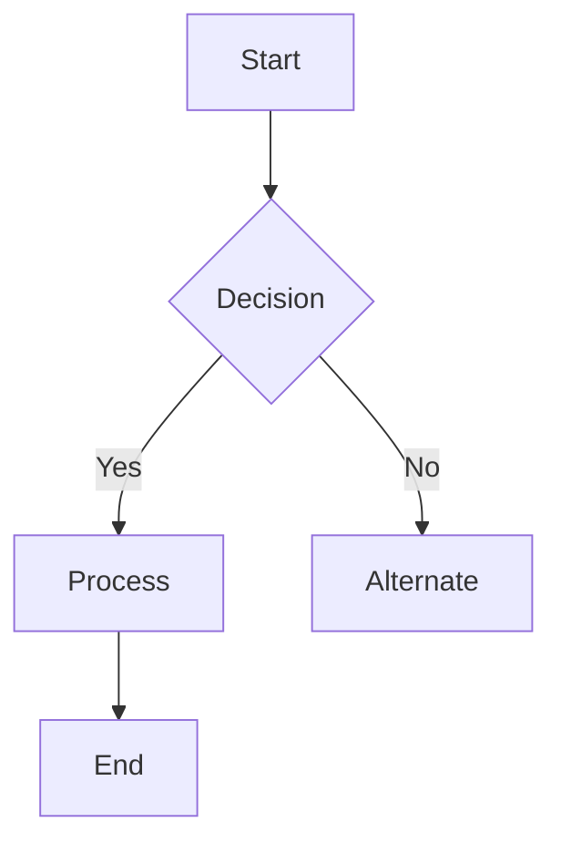
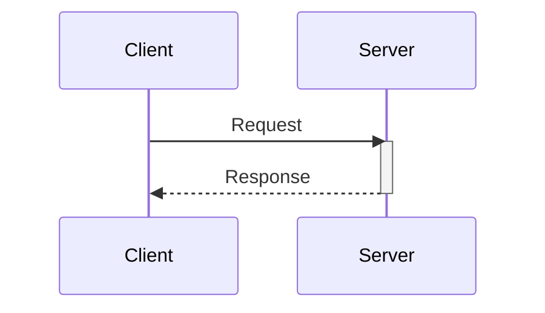
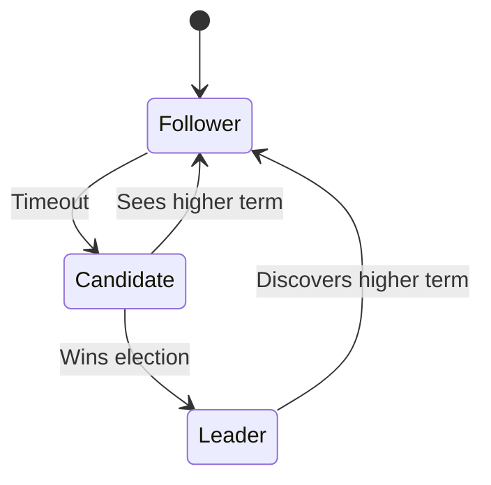

# Output Templates

Reference templates for generating course output files. Replace placeholders (`{...}`) with actual content.

IMPORTANT: All templates use parameterized placeholders. Replace:
- `{CourseName}` — e.g., "MIT 6.5840"
- `{Year}` — e.g., "2025"
- `{LectureNum}` — e.g., "L01"
- `{LectureTitle}` — e.g., "Introduction"
- `{Instructor}` — e.g., "Robert Morris"
- `{LabNum}` — e.g., "Lab01"
- `{LabName}` — e.g., "MapReduce"

---

## Template 1: Full Chinese Transcript

**Folder:** `01-Complete-Transcript/`
**Filename:** `{LectureNum}-{lecture-title}.md`

```markdown
# {LectureNum}: {LectureTitle} - 完整中文文字记录

{CourseName} {Year} | Lecture {LectureNum} | Instructor: {Instructor}

---

> **说明**: 本文字记录基于 {content source description}.

[00:00] 今天我们开始 {LectureTitle}。首先，什么是 distributed system(分布式系统)?

[00:45] 简单来说，分布式系统是一组合作的 computer(计算机)，通过网络通信来完成共同的任务，对外表现为单一系统。

[01:30] 一个经典例子是 Google 搜索引擎。当你在浏览器输入关键词，请求被发送到许多服务器，每个服务器处理一部分数据，最终汇聚成结果。这就是 MapReduce(映射归约) 的典型应用。

```python
def map(key, value):
    for word in value.split():
        emit(word, 1)

def reduce(key, values):
    emit(key, sum(values))
```



[03:20] 程序员只需写 map 和 reduce 函数，系统自动处理并行化、fault tolerance(容错)、data distribution(数据分布) 等复杂问题。

---

*学习辅助材料 - 非官方课程材料*
```

---

## Template 2: Key Points Summary

**Folder:** `02-Key-Points/`
**Filename:** `{LectureNum}-{lecture-title}.md`

```markdown
# {LectureNum}: {LectureTitle} - 重点概括

{CourseName} {Year} | Lecture {LectureNum}

## 核心概念

- **Concept 1**: Brief explanation (2-3 sentences)
- **Concept 2**: Brief explanation
- **Concept 3**: Brief explanation

## 关键流程图



## 关键决策

| 决策 | 权衡 | 理由 |
|------|------|------|
| Decision 1 | Trade-off 1 | Rationale |

## Code Examples (if applicable)

```go
// code block
```

---

*学习辅助材料 - 非官方课程材料*
```

---

## Template 3: Beginner-Friendly Explanation

**Folder:** `03-Beginner-Explanation/`
**Filename:** `{LectureNum}-{lecture-title}.md`

```markdown
# {LectureNum}: {LectureTitle} - 通俗理解

{CourseName} {Year} | Lecture {LectureNum}

## 我为什么要关心这个?

Explain why this matters in everyday life.

## 一个类比

使用贴近生活的类比。

## 通俗版本

Plain language explanation.

## 专业化版本

Precise technical definition.

## 一句话总结

One-sentence summary.

---

*学习辅助材料 - 非官方课程材料*
```

---

## Template 4: Lab Walkthrough

**Folder:** `04-Lab-Walkthrough/`
**Filename:** `{LabNum}-{lab-name}.md`

```markdown
# {LabNum}: {LabName} - 实验带做

{CourseName} {Year}

## 实验目标

- Goal 1
- Goal 2

## 前置要求

- Prerequisite 1
- Prerequisite 2

## 0. 动手前准备：环境配置

```bash
# How to set up the lab environment
```

### 0.1 涉及的代码文件

| 文件 | 需要修改? | 说明 |
|------|:--------:|------|
| `file.go` | ✅ | What you need to implement |
| `helper.go` | ❌ | Provided, don't modify |

## 架构概览



## 任务拆解

### Step 1: 核心数据结构

```go
// Complete code with WHY explanation
type Example struct {
    // Field explanations
}
```

### Step 2: 核心逻辑

```go
// Complete code with WHY explanation
func main() {
}
```

## 常见错误

| 症状 | 可能原因 | 解决方案 |
|------|----------|----------|
| Error 1 | Cause 1 | Solution 1 |

## 面试准备

- **高频问题**: Question 1?
- **思考题**: Question 2?
- **进阶讨论**: Discussion topic

---

*学习辅助材料 - 非官方课程材料*
```

---

## Mermaid Diagram Quick Reference

Use these diagram types in transcripts, key points, and lab walkthroughs:

### Flowchart (for processes / state machines)


### Sequence Diagram (for RPC / protocol flows)


### State Diagram (for state machines like Raft)


### Timing Diagram (for concurrent operations)

```mermaid
gantt
    title Operation Timeline
    dateFormat HH:mm
    axisFormat %H:%M
    section Client 1
    Op1: 00:00, 5mm
    section Client 2
    Op2: 00:02, 3mm
```


